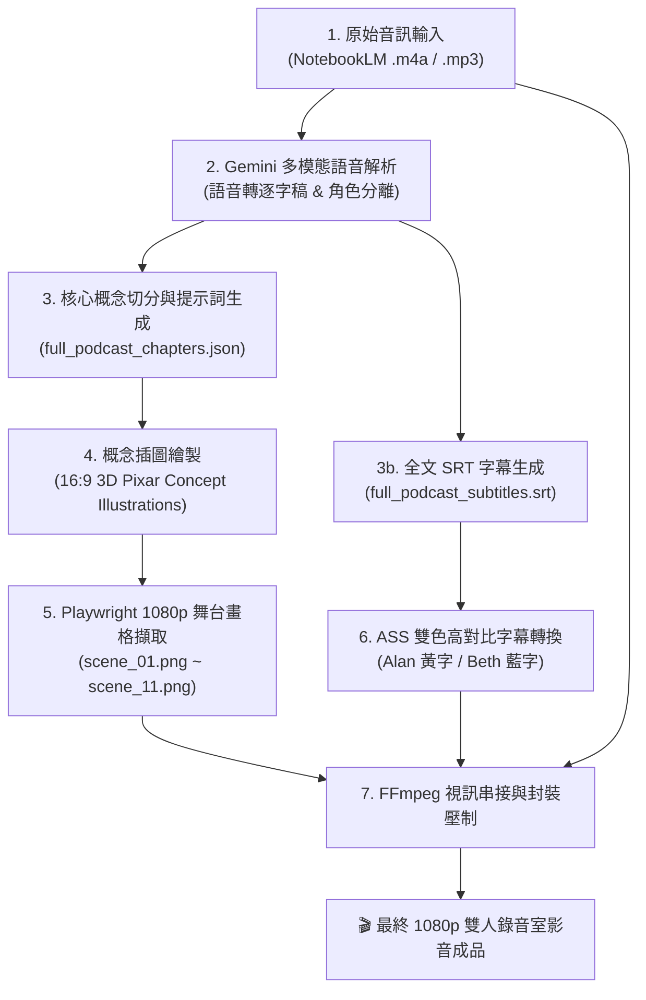

# 🎙️ 雙人 Podcast 虛擬錄音室影片製作指南 (NotebookLM to Video)

本指南完整說明如何將 Google NotebookLM 或 Gemini 生成的雙人 Podcast 音訊檔（如 `.m4a` / `.mp3`），全自動轉換為包含**「兩側主持人人偶向內聚焦 + 中央主題概念動態插圖 + 雙人高對比動態字幕」**的 1080p 高清節目影片。

---

## 🌟 核心架構與視覺理念

有別於傳統「翻頁投影片」的生硬報告模式，本工作流採用**虛擬對談錄音室（Virtual Podcast Studio）**設計：

1. **兩側主持人偶 (Visual Anchors)**：
   * **左下角**：主持人 Alan（視線自然朝向中央）。
   * **右下角**：嘉賓 Beth（視線微傾朝向中央）。
   * 穩定坐鎮、不閃爍發言框，營造沉穩、專業的導讀陪伴感。
2. **中央核心概念大螢幕 (Hero Display)**：
   * 隨對話進展，每 1.5 ~ 2.5 分鐘自動切換一張由 AI 根據對談內容提煉的 3D Pixar 風格概念插圖。
   * 將抽象心理、職場或哲學比喻（如沙灘球效應、認知籌碼零錢包、情緒課題隔離牆等）視覺化。
3. **底部中央安全字幕區 (Subtitles Dock)**：
   * 嚴格遵守工作區字幕規範：主持人採用**明黃色 (`#FFFF00`)**、嘉賓採用**淺天藍色 (`#40A9FF`)**，具備黑色粗描邊與陰影，保證 100% 清晰易讀。

```text
┌────────────────────────────────────────────────────────────────────────┐
│  [頂部資訊列]  PODCAST 漫談 · 擺脫罪惡感的平靜生產力 ｜ 當前核心議題標籤  │
│                                                                        │
│                   ┌──────────────────────────────┐                     │
│                   │                              │                     │
│                   │        中央核心概念大螢幕      │                     │
│                   │  (隨對話推進切換主題概念插圖)  │                     │
│                   │  [● 概念可視化：標籤與說明]   │                     │
│                   └──────────────────────────────┘                     │
│   ┌─────────────┐                                ┌─────────────┐       │
│   │  主持人 Alan │                                │   嘉賓 Beth │       │
│   │  (向內注視) │                                │  (向內注視) │       │
│   └─────────────┘     [底部專屬字幕區 (1100px)]   └─────────────┘       │
│                Alan: 真的，你不斷告訴自己現在需要休息...                  │
└────────────────────────────────────────────────────────────────────────┘
```

---

## 🛠️ 端到端自動化工作流 (End-to-End Pipeline)

整個流水線分為以下 5 大處理階段：



---

## 📂 核心檔案與模組架構

整個 Podcast 虛擬錄音室模組獨立收整在 `podcast_studio/` 目錄中，保持根目錄純淨整齊：

```text
sound_source/               # 音訊專屬存放資料夾 (乾淨集中存放 .m4a / .mp3 / .wav)
podcast_studio/
├── pipeline.py             # 一鍵端到端全流程主程式 (整合分析/字幕/截圖/壓制)
├── templates/
│   ├── studio_stage.html   # 1080p 舞台模板 (支援向內注視人偶與中央大螢幕)
│   └── intro_cover.html    # 開場導讀封面模板 (避免開場提前破題)
├── default_assets/         # 預設通用素材 (主持人 Alan、嘉賓 Beth、錄音室背景)
│   ├── host_alan.jpg
│   ├── guest_beth.jpg
│   └── studio_bg.jpg
└── projects/               # 各集專屬資料夾 (依音訊檔名自動隔離建檔)
    └── <Podcast名稱>/
        ├── chapters.json   # 該集 11 大章節時間軸與生圖提示詞
        ├── subtitles.srt   # 該集 238 條雙人對話逐字稿字幕
        ├── subtitles.ass   # 該集高對比雙色 ASS 字幕
        ├── concepts/       # 該集 11 張概念插圖
        └── scenes/         # 該集 11 個 1080p 舞台畫格
```

## 🖥️ 網頁圖形介面操作 (Web GUI - 一體化入口)

若偏好視覺化操作，可直接透過本專案統一的 Web GUI 進行一站式操作：

1. **啟動 Web GUI**：
   * 雙擊根目錄下的 `啟動影片製作工坊.bat` 或在終端機執行 `python core/app.py`。
   * 開啟瀏覽器訪問：**`http://localhost:8000`**。
2. **切換至錄音室模式**：
   * 點擊頂部導航列的 **`[ 🎙️ 雙人 Podcast 虛擬錄音室 ]`** 頁籤（支援自動記住上次選擇）。
3. **介面功能一覽**：
   * **左側控制面板**：
     * **專案與音訊選擇**：自動列出已存在專案（如 `擺脫罪惡感的平靜生產力`）與根目錄下音訊檔。
     * **Gemini API 金鑰設定**：提供即時金鑰狀態檢測與快速儲存。
     * **主持陣容與字幕樣式**：直觀預覽 Alan (明黃色) 與 Beth (水藍色) 人偶與色票規範。
     * **一鍵與分步執行流水線**：提供「🎬 一鍵全自動生成完整影片」與分步執行按鈕，下方即時終端控制台串流顯示處理進度。
   * **右側主要工作區**：
     * **影片成果播放器**：內嵌 16:9 播放器，可直接線上播放全片，並提供一鍵下載影片、下載 SRT / ASS 字幕按鈕。
     * **核心概念插畫畫廊**：網格展示各章節 3D 概念圖、時間範圍、主題名稱與核心洞見。支援點擊「更換插圖」上傳新圖（自動重新合成該章節畫格），以及「編輯內容」微調標題與說明。
     * **雙人逐字稿對話清單**：折疊面板即時瀏覽對話時間軸與男女主持發言標籤。

---

## 🚀 命令列執行指南 (CLI Automation)

### 一鍵完成全片影片生成：
只需在命令列傳入音訊檔名，系統會自動在 `podcast_studio/projects/<集數名稱>/` 建立專屬工作目錄，並直接將最終 1080p 影片產出至 `MovieOutput/`：

```bash
python podcast_studio/pipeline.py "擺脫罪惡感的平靜生產力.m4a"
```

### 亦支援分步調適執行（可選）：
```bash
# 只進行語意分析與概念章節提煉：
python podcast_studio/pipeline.py "擺脫罪惡感的平靜生產力.m4a" --step analyze

# 只生成雙人逐字稿與雙色字幕：
python podcast_studio/pipeline.py "擺脫罪惡感的平靜生產力.m4a" --step subtitles

# 重新以 Playwright 截取 1080p 舞台畫格：
python podcast_studio/pipeline.py "擺脫罪惡感的平靜生產力.m4a" --step scenes

# 執行最終 FFmpeg 影音串接與字幕壓制：
python podcast_studio/pipeline.py "擺脫罪惡感的平靜生產力.m4a" --step render
```


---

## 🎨 視覺與字幕規範指引 (Workspace Rules)

在自訂或調整模板時，必須遵守以下規範：

1. **黑底/深色字幕配色規範**：
   * **主持人 A (Alan)**：採用**明黃色 (`#FFFF00`)**，醒目度最佳。
   * **嘉賓 B (Beth)**：採用**淺天藍/水藍色 (`#40A9FF`)**，對比鮮明。
   * **嚴格禁止**：深藍色、深紅色、墨綠色、深紫色或刺眼高飽和螢光色。
   * **輔助樣式**：必須保留黑色細描邊（`outline: 3.5`）與適度陰影（`shadow: 2`）。
2. **章節切換節奏**：
   * 每個視覺章節建議維持在 **90 ~ 150 秒**（1.5 ~ 2.5 分鐘），避免畫面停留過久產生視覺疲勞，也不宜切換過頻導致分散注意力。
3. **主持人視線方向**：
   * 左側人偶視線與身體微傾朝向右方（中央）。
   * 右側人偶視線與身體微傾朝向左方（中央）。
